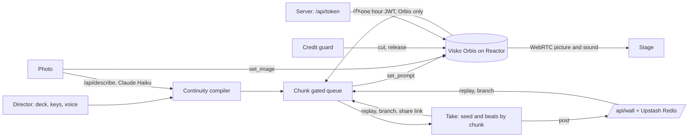

# UNSTILL

**The photograph is the first frame.**

UNSTILL is a live direction deck for places, built on Visko Orbis. Lock a location or bring your own photograph, then change the hour, the weather, the crowd and the camera while the world keeps running. Orbis carries every change into the live picture at the next chunk, without a cut. Call the shot by voice, keep every run as a take, branch any take into a different future, and share it on a public wall where anyone can replay it.

| | |
| --- | --- |
| Live app | https://unstill-pied.vercel.app |
| Studio | https://unstill-pied.vercel.app/studio |
| The wall of shared takes | https://unstill-pied.vercel.app/wall |
| Replay a live take | https://unstill-pied.vercel.app/studio#take=featured |
| Full walkthrough, every feature filmed live (5:49) | https://unstill-pied.vercel.app/walkthrough.mp4 |
| Demo film | https://unstill-pied.vercel.app/demo.mp4 |
| Unedited live take | https://unstill-pied.vercel.app/live-take.mp4 |

Made for the Visko Orbis Online Challenge, 2026, by Uzoechi Raphael.

## Try it in 60 seconds

1. Open the [studio](https://unstill-pied.vercel.app/studio). The Corner is selected.
2. Press **Go live** (top right) or **Roll · go live** on the picture. About twenty seconds later the street is live at dusk.
3. Press **E** for rain, then **4** for night. Each change lands on the next Orbis chunk, and the watch log stamps the chunk with a live thumbnail.
4. Press **Direct by voice** and say *"have the taxi pull up"*, then *"push in"*. The caption on the picture shows what was heard and what it did.
5. Or press **Run cue sheet** and watch a ninety second scene direct itself.
6. Press **Save HD video** for a 1080p MP4 of the session so far. Then press **Cut**. Your run is saved under **Takes**.
7. On the take: **Copy link** to share it, **Post to the wall** to publish it, or pick a beat under **What if, after** and press **Branch** to direct a different future from that moment.
8. Press **Release GPU** when you are done. If you forget, the credit guard does it for you.

To see a recorded run without spending a session, open the [featured take](https://unstill-pied.vercel.app/studio#take=featured), browse [the wall](https://unstill-pied.vercel.app/wall), or watch the [walkthrough](https://unstill-pied.vercel.app/walkthrough.mp4).

## Why it needs a Live Model

A clip is finished the moment it renders. To make it rain, you render another one, and you get another street. A place keeps running. In UNSTILL you make it rain on the street that is already there, let night fall on it, then empty it, in one continuous shot. That only exists with real time generation.

## How it maps to the Live Model pillars

Visko describes Live Models through six pillars. This is where each one shows up in UNSTILL.

| Pillar | In UNSTILL |
| --- | --- |
| Clocked | The studio listens to `chunk_complete` and releases directives on chunk boundaries, at most one per settle window, so every change lands in step with the stream |
| Interactive | Hour, weather, crowd, camera and events change a running world. Nothing restarts |
| Full-duplex | Direct by voice: the world keeps generating while you speak, and each phrase becomes a directive on the next beat |
| Stateful | One world persists through every change. Takes record the seed and each beat by chunk, and replay the same world |
| Physical | Branching: replay a take to any beat, then direct a different ending. One shared past, two futures of the same street. The walkthrough shows both side by side, frame matched until the fork |
| Self-evolving | The wall: every take someone posts becomes a starting point anyone can replay and branch, so the body of directed worlds keeps growing |

## Features

| Feature | What it does |
| --- | --- |
| Watches | Three locked worlds: The Corner (film and media), The Aisle (retail), The Bay (robotics and training). Each card in the studio says what the place is for |
| Your photograph | Cropped to 16:9 in the browser, uploaded, and set as the first frame with `set_image`. A one line description holds Orbis to the photographed place after the first frame |
| Automatic description | When `ANTHROPIC_API_KEY` is set, the studio describes your photograph for you the moment you choose it (Claude Haiku 4.5 through `/api/describe`). The line stays editable. The photo is sent once and never stored. Without the key the field is simply typed by hand |
| Direction deck | Hour, weather, occupancy and camera, four event pads per Watch, keyboard shortcuts, and a free beat line |
| Direct by voice | Say "action", "rain, then night", "have the taxi pull up", "hold", "resume", "cut". Parsed in order and released on the beat |
| Continuity compiler | The opening builds the world once. Every prompt after it names one visible change, following the Orbis prompt guide |
| Chunk gated release | A visible queue releases one directive per settle window so morphs never collide |
| Hold and resume | Freeze the world on a chunk and carry on from the same frame, by button or by voice |
| Cue sheets | A scripted sequence per Watch that plays on chunk timing, startable by voice |
| Takes | Seed, opening and every beat stamped with its chunk. Export, import, replay |
| Branching | Fork any take after any beat and direct a different future. Saved as its own take |
| Share a take | One link carries the whole take. Anyone can open it and replay |
| The wall | `/wall`: takes people chose to publish, each with its world, seed and beats. One click opens it in the studio to replay or branch. Posts are validated and length capped on the server, rate limited, de-duplicated by content, and photo takes stay private |
| Watch log | Every prompt with its chunk and a thumbnail grabbed from the live picture |
| Save HD video | Downloads the session as a 1080p, 30 fps MP4 with the stream's own sound, recorded on Reactor's servers (`requestRecording` and `downloadClipAsFile`), so the viewer's machine does no encoding |
| Record | Saves the live picture to a .webm file in the browser |
| Go live | One click from the tally or the picture starts a session. Sessions start only on demand |
| Credit guard | A run with nobody directing it is cut after two minutes, with a twenty second warning and a Keep going button. Runs are capped at ten minutes, a GPU left connected after a Cut is released after a minute, and closing the tab ends the session. Takes are always kept |
| Deep links | `/studio?watch=aisle` opens a Watch, `/studio#take=...` opens a shared take |
| Site | Home with the walkthrough film, Watches with live Orbis loops of every world, How it works, Docs, FAQ and the wall, each a standalone page |

## Architecture



## Run it locally

```bash
npm install
cp .env.example .env.local   # then add your Reactor API key
npm run dev
npm test                      # 87 unit tests
```

Open http://localhost:3000 for the site and http://localhost:3000/studio for the studio.

## Tests

`npm test` runs 87 Vitest checks:

- every opening prompt builds the world in under 120 words and every shift prompt is one short visible change with no negations, for every Watch and every directive (rules from the Orbis prompt guide)
- the photo opening holds Orbis to the described place, with no negations
- every cue sheet references real controls and events, and keyboard shortcuts are unique
- the voice parser reads directives in spoken order, understands set language, and ignores chatter
- take links round trip, garbage is rejected, and the featured take respects the settle window
- the credit guard warns, cuts idle runs, caps long ones, releases a parked GPU, and leaves cue sheets and replays alone
- the wall accepts real takes, refuses photo takes, unknown worlds, empty takes and bad seeds, caps lengths, strips control characters, de-duplicates, and round trips every post back into a replayable take
- the rate limiter allows, refuses and recovers on time

## Environment

| Variable | Required | Notes |
| --- | --- | --- |
| `REACTOR_API_KEY` | Yes | From the Reactor dashboard at reactor.inc. Starts with `rk_`. Server side only |
| `KV_REST_API_URL`, `KV_REST_API_TOKEN` | For the wall | Added automatically when you connect Upstash Redis to the project in Vercel (Storage, then Upstash for Redis, free plan). `UPSTASH_REDIS_REST_URL` and `UPSTASH_REDIS_REST_TOKEN` also work. Without them the wall shows a friendly notice |
| `WALL_ADMIN_KEY` | Optional | Any secret string. Lets you remove a post: `DELETE /api/wall?id=...&key=...` |
| `ANTHROPIC_API_KEY` | Optional | Turns on automatic photo descriptions. From console.anthropic.com. Roughly a tenth of a cent per photo with Haiku |
| `ANTHROPIC_MODEL` | Optional | Defaults to `claude-haiku-4-5-20251001` |

No key ever reaches the browser. `app/api/token/route.ts` exchanges the Reactor key for a one hour JWT scoped to `reactor/visko-orbis-stable` and a single session. Sessions start only when someone presses Go live, and Cut, Release GPU or the credit guard ends them.

## Deploy on Vercel

1. Import this repository at vercel.com/new. The framework preset is Next.js.
2. Under Environment Variables add `REACTOR_API_KEY` (and optionally `ANTHROPIC_API_KEY` and `WALL_ADMIN_KEY`).
3. Under Storage, connect Upstash for Redis to turn on the wall.
4. Deploy.

## Project map

```
app/(site)/                  Home, Watches, How it works, Docs, FAQ, the wall
app/studio/page.tsx          The studio
app/api/token/route.ts       JWT minting
app/api/wall/route.ts        The wall: list, post, moderate
app/api/describe/route.ts    One line photo descriptions
hooks/use-unstill.ts         Session engine: roll, direct, queue, cue, takes, replay, branch, release
hooks/use-credit-guard.ts    Idle cut, run cap, parked GPU release
hooks/use-voice.ts           Speech recognition to deck actions
hooks/use-server-recording.ts Save HD video
lib/watches.ts               Worlds, directive vocabulary, events, cue sheets
lib/compiler.ts              Opening and shift prompts
lib/voice.ts                 Voice phrase parser
lib/take.ts                  Take storage, export, import, share links
lib/wall.ts                  Wall post validation and conversion
lib/kv.ts                    Upstash Redis REST client
lib/featured.ts              Featured live take
tests/                       Vitest suite
```

## Built with

Next.js 16, React 19, `@reactor-team/js-sdk`, Vitest, Upstash Redis, Claude Haiku 4.5 for photo descriptions, and Visko Orbis Stable served by Reactor.
